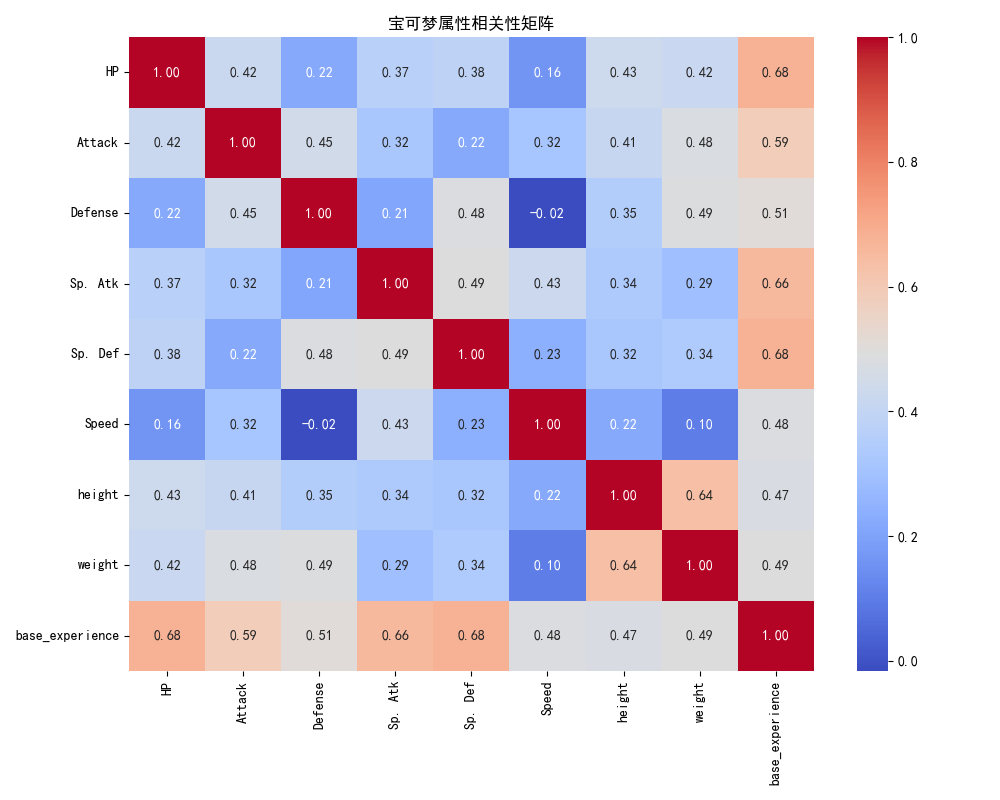
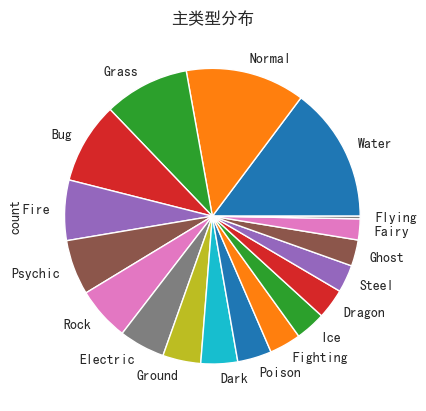
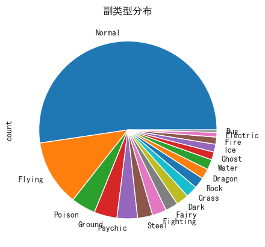
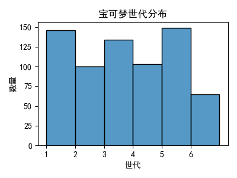
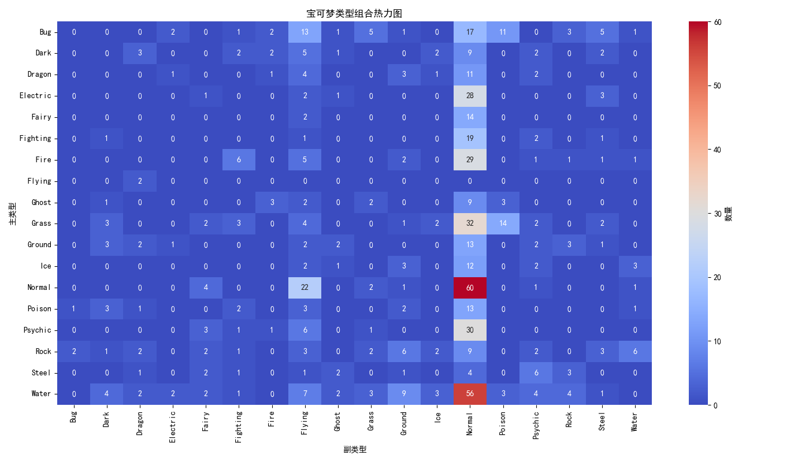
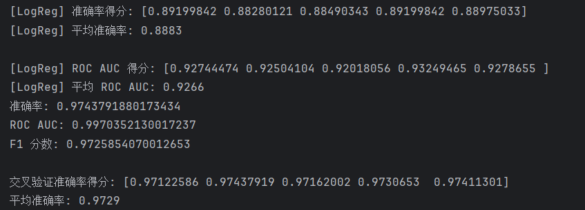
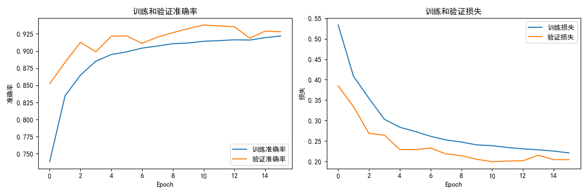
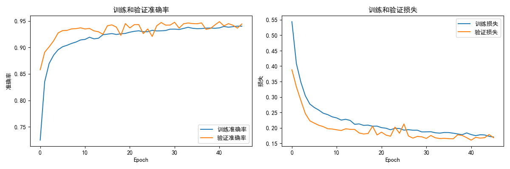
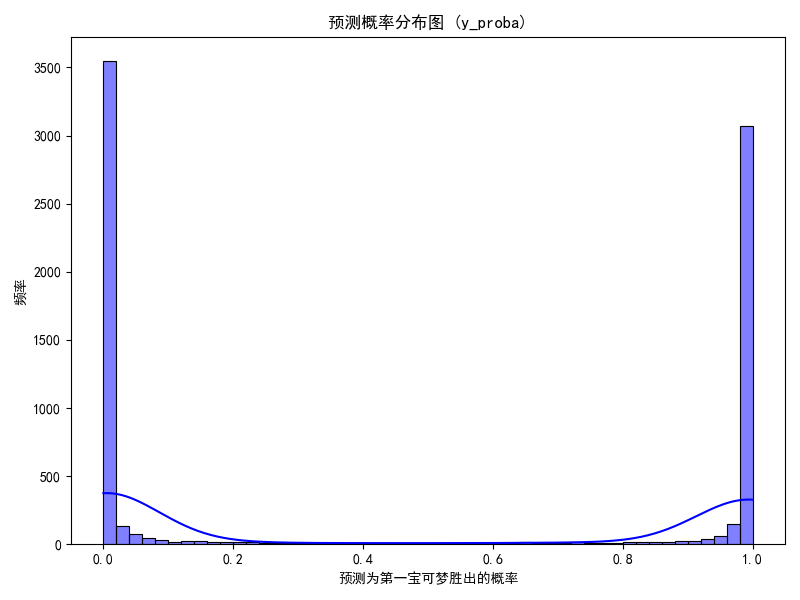
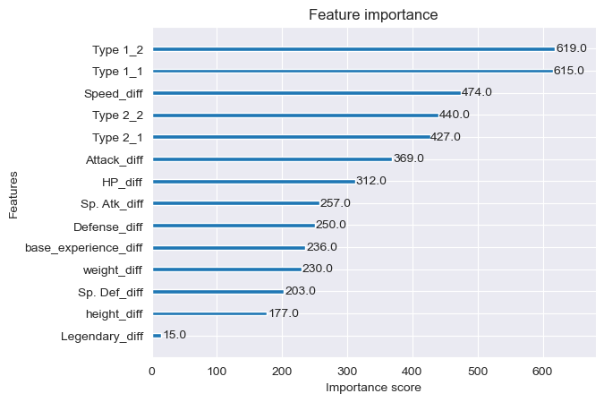

# 宝可梦对战战胜预测模型实验报告

## 1. 实验概述

### 1.1 实验目标
本实验旨在构建和比较不同机器学习模型对宝可梦对战结果的预测能力，通过系统评估各模型的性能指标，为实际应用提供模型选择依据。

### 1.2 数据来源
本实验使用了kaggle上的数据集:(https://www.kaggle.com/datasets/lmno3418/pokedex-pokemon-data)

### 1.3 实验方法
采用交叉验证和测试集评估相结合的方式，对比了以下三类模型：
1. 传统机器学习模型：逻辑回归(Logistic Regression)
2. 集成学习模型：XGBoost
3. 深度学习模型：神经网络(Neural Networks)

### 1.4 评估指标
主要使用三个核心指标：
- 准确率(Accuracy)：预测正确的比例
- ROC AUC：模型区分正负样本的能力
- F1分数：精确率和召回率的调和平均

## 2. 数据集与特征分析

### 2.1 数据集特征
数据集包含宝可梦的多种属性特征：
- 基础属性：HP、攻击(Attack)、防御(Defense)等
- 特殊属性：特殊攻击(Sp.Att)、特殊防御(Sp.Def)
- 物理特征：身高(height)、体重(weight)
- 经验值：基础经验(base_experience)

### 2.2 属性相关性分析

关键相关性发现：
1. **基础经验与其他属性的关系**：
   - 与HP相关性最高(0.68)
   - 与特殊攻击(0.66)和特殊防御(0.68)也有强相关
   - 这表明高经验值的宝可梦往往综合属性更强

2. **攻击与防御的关系**：
   - 攻击与防御相关性为0.45
   - 说明高攻击的宝可梦往往也有一定防御能力

3. **特殊属性关系**：
   - 特殊攻击与特殊防御相关性0.49
   - 表明这两项属性往往同步发展

### 2.3 主类型分布

- 宝可梦存在属性克制
- 可以看出，许多宝可梦的副属性都是普通系

### 2.3 副类型分布

- 主要类型包括：Normal、Grass、Water等
- 存在一些稀有类型如Psychic、Flying、Dark等
- 类型多样性可能影响对战结果预测

### 2.4 宝可梦世代分布

- 经常玩游戏的都知道，游戏是会数值膨胀的，所以一般来说世代越靠后，宝可梦就越强
- 可以看到，数据集中各个世代的宝可梦的分布较接近

### 2.5 宝可梦类型组合情况

## 3. 模型性能比较

*注：模型1，2，3使用的特征包含对战宝可梦双方的属性、世代和各项参数的差值（比如血量、攻击力）

### 3.1 逻辑回归(基准模型)

**性能指标**：
- 平均准确率：0.8883 (±0.0036)
- 平均ROC AUC：0.9266 (±0.0043)

**分析**：
- 作为基准模型表现尚可
- 五折交叉验证结果稳定
- 适合作为初步筛选工具

### 3.2 XGBoost模型

**性能指标**：
| 指标    | 值     | 标准差 |
| ------- | ------ | ------ |
| 准确率  | 0.9744 | 0.0013 |
| ROC AUC | 0.9970 | -      |
| F1分数  | 0.9726 | -      |

**优势分析**：
1. 准确率比逻辑回归提升约9%
2. ROC AUC接近完美(0.997)
3. 处理非线性关系能力强
4. 自动特征选择能力

### 3.3 神经网络模型

#### 3.3.1 使用差值特征的神经网络

**改进点**：
- 调整了网络结构
- 优化了正则化参数
- 修改了学习率策略

**测试结果**：
| 指标    | 值     |
| ------- | ------ |
| 准确率  | 0.9402 |
| ROC AUC | 0.9717 |
| F1分数  | 0.9365 |

#### 3.3.2 简单神经网络

**训练过程**：

- 约15个epoch后收敛
- 最终训练准确率约0.95
- 验证准确率与训练准确率接近，无过拟合

**测试结果**：
| 指标    | 值     |
| ------- | ------ |
| 准确率  | 0.9495 |
| ROC AUC | 0.9832 |
| F1分数  | 0.9466 |

**对比分析**：
- 简单网络表现更好
- 可能改进方向不当导致性能下降
- 需要进一步调优

## 4. 预测概率分析（XGBoost）

**关键发现**：
1. 分布呈现明显双峰：
   - 高峰在0-0.2区间(预测负类)
   - 高峰在0.8-1.0区间(预测正类)
   
2. 中间概率(0.4-0.6)占比较少：
   - 说明模型预测置信度高
   - 较少出现模棱两可的预测

3. 实际应用意义：
   - 高置信度预测可直接采用
   - 中间概率预测可人工复核

## 5. 各特征重要性

- 宝可梦有两个重要的设定：一是属性相克，二是属性一致加成（使用技能的属性和本身属性相同时，伤害加成50%）
- 可以看出，属性在宝可梦对战决胜因素中占相当大的重要性（前五项占四项）

## 5. 模型训练动态分析

### 5.1 神经网络训练过程

**观察结果**：
1. 准确率曲线：
   - 快速上升期(0-10 epoch)
   - 平稳期(10-40 epoch)
   - 最终稳定在约0.95

2. 损失曲线：
   - 训练与验证损失同步下降
   - 无显著过拟合迹象
   - 后期波动较小

### 5.2 使用差值特征的网络训练过程

**对比发现**：
- 收敛速度更快(约10 epoch)
- 但最终性能略低
- 可能过早收敛到局部最优

## 6. 结论

### 6.1 主要结论
1. **模型性能排序**：
   - XGBoost > 简单NN > 差值NN > 逻辑回归
   - XGBoost在各项指标上全面领先

2. **适用场景建议**：
   - 高精度需求：优先选择XGBoost
   - 可解释性需求：考虑逻辑回归
   - 在线学习场景：神经网络更合适

3. **特征重要性**：
   - 基础经验是最具预测力的特征
   
   - 攻击与防御属性组合很重要
   
## 7. 代码及数据
代码及数据已经放至github仓库:(https://github.com/No-99-Tongji/Pokemon_battle_outcome_prediction)
